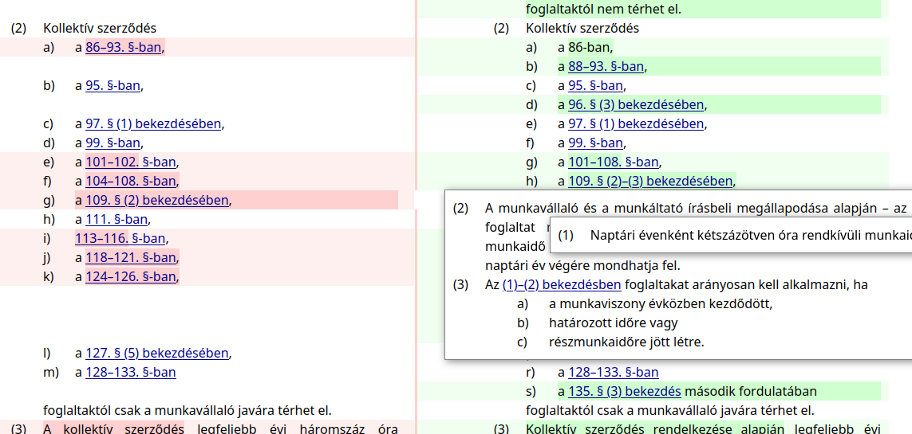

# Alex Jogi aDatBázisa (Rust version)

A small project for computing the in-force state of Hungarian law and
then displaying them on a web UI.

You can see it in action at **[ajdb.hu](https://ajdb.hu)**

See [this hungarian presentation](https://ajdb.hu/prez/basic_sales/) about the project.

The web UI:

* Shows the in-force state of processed act for any date between its publication and 1-2 years into the future
* Shows past and upcoming changes
* Diff view between any two states of an act
* Shows snippets of referenced act parts in popups. Multilevel snippets are supported.

The applier:

* Computes the act states based on the base act and amendments.
* Handles complex transitive cases, especially changes in enforcement dates.

Currently only a few of the most important acts are supported and only up to 2022.12.01

## Usage

The project is deployed to https://ajdb.hu , but you can also run it locally:

1. Clone [`hun_law`](https://github.com/badicsalex/hun_law_rs) in a sibling directory.
2. Recalculate the whole database by running `./full_recalc.sh`
3. Run the local webserver: `cargo run --bin ajdb-web`

## Contribution

Feel free to open issues for feature requests or found bugs. Merge Requests are more than welcome too.
